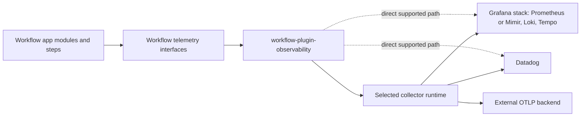

# Observability Plugin Design

## Context

Workflow currently has useful observability primitives, but they are split across
core `workflow` and several application or provider plugins:

- `workflow/module/otel_tracing.go` owns `observability.otel` and exports traces
  via OTLP/HTTP.
- `workflow/module/metrics.go` owns `metrics.collector` and exposes a
  Prometheus `/metrics` handler.
- `workflow/module/log_collector.go` owns `log.collector` and exposes collected
  logs through an HTTP endpoint.
- `workflow-plugin-datadog` owns Datadog API steps for metrics, logs,
  monitors, dashboards, APM retention filters, and spans.
- `workflow-plugin-digitalocean` can map App Platform log destinations to
  Datadog, generic HTTP, Papertrail, and Logtail.
- `workflow-plugin-cms` owns a custom Prometheus-compatible `/metrics` endpoint.

These pieces do not yet provide the requested plug-and-play model: a Workflow
YAML module that can provision/deploy collection infrastructure through `wfctl`
and IaC, configure applications to emit telemetry, and route traces, metrics,
and logs to customer-selected backends.

## Goals

- Create `workflow-plugin-observability` as the reusable observability plugin.
- Prefer OpenTelemetry and OTLP as the default app-to-collector contract.
- Support selectable collector runtimes per environment: upstream OpenTelemetry
  Collector, Grafana Alloy, Datadog Agent/DDOT, direct Datadog OTLP intake, and
  externally managed collectors.
- Support Grafana/Prometheus/Loki/Tempo/Mimir and Datadog integrations, using
  existing SDKs or native collector/exporter config where possible.
- Move custom `/metrics` endpoints out of application plugins and core where
  they are unnecessary. Applications should use neutral telemetry interfaces and
  the observability plugin's collection path instead.
- Let modules, steps, and plugins emit custom metrics/logs/traces by satisfying
  Workflow-owned interfaces without importing `workflow-plugin-observability`.
- Make `wfctl` and provider plugins able to provision collector resources,
  secrets, network policy, service discovery, and app environment wiring from a
  provider-neutral observability intent.
- Migrate `/metrics` endpoints only when parity tests prove the replacement
  emits equivalent counters/histograms/gauges through the neutral telemetry path.

## Non-Goals

- Building a full Grafana or Datadog clone.
- Replacing Datadog API steps for dashboards, monitors, SLOs, and searches.
- Requiring every Workflow application to run a collector.
- Requiring plugin authors to import OpenTelemetry SDK packages just to emit
  basic telemetry.
- Preserving custom `/metrics` HTTP endpoints when a neutral telemetry interface
  and collector/scrape path can replace them.
- Shipping dashboard/alert authoring in the first implementation phase.

## Architecture

The design splits responsibilities into three layers.

### 1. Workflow Core Contracts

Workflow core owns small, stable interfaces for telemetry producers and
recorders. These contracts live in core or the external plugin SDK, not in
`workflow-plugin-observability`, so ordinary plugins can satisfy them without a
hard dependency on the observability plugin.

Initial contracts:

```go
type TelemetryAttributes map[string]string

type MetricEmitter interface {
	EmitMetrics(context.Context, MetricRecorder) error
}

type MetricRecorder interface {
	Counter(name string, value float64, attrs TelemetryAttributes)
	Gauge(name string, value float64, attrs TelemetryAttributes)
	Histogram(name string, value float64, attrs TelemetryAttributes)
}

type LogEmitter interface {
	DrainTelemetryLogs(context.Context) []TelemetryLogRecord
}

type TraceAnnotator interface {
	AnnotateSpan(context.Context, SpanRecorder)
}
```

The exact names can change during implementation, but the boundary is fixed:
producer interfaces belong to Workflow core/SDK; exporter implementations
belong to the observability plugin.

### 2. Observability Plugin Runtime

`workflow-plugin-observability` owns modules that translate Workflow YAML into
runtime behavior and IaC intent.

Primary module types:

- `observability.telemetry`: app-facing telemetry setup. Configures service
  identity, deployment environment, resource attributes, sampling, log level,
  metric collection interval, and preferred OTLP endpoint.
- `observability.collector`: collector declaration. Selects distribution
  (`otelcol`, `alloy`, `datadog-agent`, `datadog-otlp`, `external`), topology
  (`sidecar`, `service`, `daemonset`, `app-component`, `external`), receivers,
  processors, exporters, and enabled signals.
- `observability.scrape`: scrape/log discovery intent for Prometheus/OpenMetrics
  endpoints, container logs, stdout/stderr, and provider-native log streams.
- `observability.route`: signal routing rules. Examples: traces to Tempo and
  Datadog, metrics to Prometheus remote write and Datadog, logs to Loki and
  Datadog.

Optional later module types:

- `observability.dashboard`: dashboard intent that can target Grafana or
  Datadog through their APIs.
- `observability.alerts`: alert/monitor intent that can target Prometheus
  rules, Grafana Alerting, or Datadog monitors.

These are explicitly phase-two or later. The first implementation phase stops at
emit, collect, render, provision intent, and export.

### 3. Provider and IaC Integration

Provider plugins own concrete provisioning. The observability plugin produces
provider-neutral deployment intent; `wfctl` and provider plugins translate it.

The cross-repo boundary is an explicit provider-planning contract. The
observability plugin emits an `ObservabilityPlan` value through Workflow/wfctl
interfaces, and provider plugins that support observability declare a consumer
adapter for that plan. The plan is data, not executable deployment code.

Initial `ObservabilityPlan` shape:

```go
type ObservabilityPlan struct {
	ServiceName   string
	Environment   string
	ResourceAttrs map[string]string
	Collector     CollectorPlan
	Pipelines     []TelemetryPipeline
	AppEnv         map[string]SecretOrValueRef
	Resources     []GeneratedResourceRef
}
```

`workflow` or `wfctl` owns the shared interface and type boundary. The
observability plugin owns plan generation and validation. Provider plugins own
translation to App Platform, Kubernetes, Terraform/OpenTofu, or provider-native
resources. Unsupported plan features must produce diagnostics before apply.

Examples:

- Kubernetes: ConfigMap/Secret for collector config, Deployment or DaemonSet,
  Service for OTLP endpoints, ServiceMonitor/PodMonitor or annotations where
  supported, NetworkPolicy, and optional Grafana Alloy deployment.
- DigitalOcean App Platform: collector as a service/component where possible,
  app env vars for OTLP endpoints, existing `log_destinations` for platform log
  shipping, and warnings when requested topologies are unsupported.
- External collector: no provisioned collector; only app env/config wiring and
  validation that required endpoint/secret references exist.
- Datadog: direct OTLP intake, Datadog Agent/DDOT deployment, or Datadog
  exporter configuration depending on environment and user choice.

Generated resource names and labels are deterministic:

- `workflow.gocodealone.io/managed-by: workflow-plugin-observability`
- `workflow.gocodealone.io/app: <app>`
- `workflow.gocodealone.io/environment: <environment>`
- `workflow.gocodealone.io/collector: <collector-name>`

These labels are required for rollback and drift detection. Provider plugins
must delete or mutate only resources with matching ownership labels unless the
user explicitly opts into adopting pre-existing resources.

## Distribution Rendering

The plugin uses an intermediate telemetry pipeline model rather than treating
collector configs as interchangeable text. Renderers convert the model to the
selected runtime:

- OTel Collector renderer: emits collector YAML with receivers, processors,
  exporters, extensions, and service pipelines.
- Grafana Alloy renderer: emits River components for OTel, Prometheus, Loki,
  Tempo/Mimir, and Grafana Cloud paths.
- Datadog Agent/DDOT renderer: emits agent/collector configuration and app env
  wiring for OTLP ingest.
- External renderer: emits only app env/config and validation diagnostics.

The renderer boundary prevents Alloy-specific syntax from leaking into OTel
Collector YAML and lets each distribution validate its supported components.

## Data Flow



OTel/OTLP is preferred for traces, metrics, and logs. Direct integrations remain
supported when they are materially better for the target backend, for example
Datadog dashboard/monitor APIs, Grafana dashboard APIs, Loki log push in small
deployments, or Prometheus scrape config generation.

## Configuration Sketch

```yaml
modules:
  - name: telemetry
    type: observability.telemetry
    config:
      serviceName: checkout-api
      environment: production
      resource:
        team: platform
        app: checkout
      metrics:
        interval: 15s
      traces:
        sampleRatio: 0.25
      logs:
        level: info

  - name: collector
    type: observability.collector
    config:
      distribution: alloy
      topology: service
      signals: [traces, metrics, logs]
      receivers:
        otlp:
          protocols: [grpc, http]
      exporters:
        tempo:
          type: otlp
          endpoint: tempo.monitoring.svc:4317
        loki:
          type: loki
          endpoint: http://loki.monitoring.svc:3100/loki/api/v1/push
        prometheus:
          type: prometheus_remote_write
          endpoint: http://mimir.monitoring.svc/api/v1/push
        datadog:
          type: datadog
          apiKeyRef: secret://observability/datadog_api_key
```

## Refactor Scope

Hard update custom metrics endpoints:

- Remove `workflow-plugin-cms/monitoring` and its `/metrics` route once the app
  records the same counters through Workflow telemetry interfaces.
- Migrate `workflow/module/metrics.go` from owning exporter-specific
  Prometheus HTTP serving to a compatibility wrapper over the neutral recorder,
  then deprecate direct `/metrics` exposure where applications can use the new
  plugin.
- Update `wfctl` templates that currently insert `metrics.collector` so new
  projects get `observability.telemetry` plus an opt-in collector declaration.

Existing YAML compatibility can be retained through migration warnings or
adapters, but the target architecture removes unnecessary custom `/metrics`
surfaces.

Migration gates for every `/metrics` removal:

1. A focused parity test records representative traffic or module activity and
   asserts the neutral recorder receives the same metric names, values, and
   labels that the old endpoint exposed.
2. A runtime smoke check launches the app with `observability.telemetry` enabled
   and confirms telemetry reaches either an in-memory test exporter or a local
   collector.
3. Dependent app YAML is updated in the same PR or an explicitly linked PR.
4. Rollback instructions name the exact commit or YAML change that re-enables
   the old endpoint if the replacement path fails.

## Error Handling

- Invalid collector distribution/topology/signal combinations fail validation
  before deployment.
- Unsupported provider topology produces a diagnostic with supported fallbacks.
- Missing secret references fail validation and never log secret values.
- Collector config generation validates receiver/exporter/pipeline references.
- Runtime exporter failures are recorded as telemetry plugin health diagnostics
  and surfaced through `wfctl` status/troubleshooting commands.

## Security and Privacy

- Secret values are resolved through Workflow secrets interfaces and are never
  embedded in generated docs, logs, or plan output.
- Network exposure defaults to private collector endpoints. Public OTLP ingest
  requires explicit opt-in, TLS, authentication, and provider-supported network
  controls.
- Tenant/environment/resource attributes are attached at collection time so
  multi-tenant backends can separate data.
- Telemetry attribute allow/deny rules run before export. Known sensitive keys
  such as `password`, `token`, `secret`, `authorization`, `cookie`, and
  `set-cookie` are deny-listed by default unless the user explicitly overrides
  the policy.
- Direct Datadog/Grafana API integrations use scoped API keys and provider-owned
  secret references.
- The plugin treats logs as potentially sensitive and avoids default stdout log
  mirroring outside the selected backend pipeline.

## Rollback

Runtime rollback has three levels:

1. Application rollback: remove `observability.telemetry` and collector env vars
   from Workflow YAML, then redeploy the previous app version.
2. Collector rollback: disable or remove `observability.collector`; provider
   plugins delete generated collector resources or revert to an external
   collector endpoint.
3. Interface rollback: producer interfaces are additive in Workflow core/SDK.
   Existing modules continue to compile even if the observability plugin is not
   installed.

For the `/metrics` removal work, rollback is a revert of the app/plugin commit
plus re-enabling the prior route until dependent applications are migrated.

Generated collector resources must carry the ownership labels listed in
Provider and IaC Integration. Rollback and drift repair are restricted to those
labels so unrelated user-managed Grafana, Datadog, or collector resources are
not deleted.

## Delivery Phases

Phase 1 is intentionally small and independently shippable:

1. Scaffold `workflow-plugin-observability`.
2. Add neutral telemetry interfaces to Workflow core/SDK.
3. Implement `observability.telemetry` and an in-memory/test exporter.
4. Implement `observability.collector` validation and intermediate pipeline
   model.
5. Implement OTel Collector YAML rendering and external-collector env wiring.
6. Migrate one current `/metrics` producer behind parity tests.

Phase 2 adds managed collector provisioning through `wfctl` and provider plugin
adapters, beginning with the provider we dogfood first.

Phase 3 adds Grafana Alloy, Datadog Agent/DDOT, direct Datadog OTLP intake, Loki
push, Prometheus remote-write/scrape helpers, and richer backend-specific
resources.

Dashboards and alert authoring are deferred until collection/export paths are
working and dogfooded.

## Assumptions

- Workflow core/SDK can accept small neutral telemetry interfaces without
  violating plugin ownership boundaries.
- Provider plugins can consume provider-neutral observability intent through
  `wfctl` without importing `workflow-plugin-observability`.
- OTLP is the right default app-to-collector protocol for Workflow applications.
- Direct backend integrations remain necessary for backend-specific resources
  such as dashboards, monitors, and retention controls.
- We control all current consumers of the custom `/metrics` endpoints, so hard
  updating them is acceptable.
- Customers will vary collector runtime by environment, so collector selection
  cannot be hard-coded.

## Alternatives Considered

1. Keep observability in core `workflow`.
   - Rejected because exporter and collector choices would continue to accrete
     in core and make customer-specific deployments harder.
2. Put observability in each cloud/provider plugin.
   - Rejected because it would duplicate collector semantics and make app YAML
     non-portable.
3. Require all plugins to import OTel SDK packages directly.
   - Rejected because it creates hard dependencies and fights the desired
     structural interface model.

## Sources

- OpenTelemetry Collector configuration:
  https://opentelemetry.io/docs/collector/configuration/
- Grafana Alloy architecture:
  https://grafana.com/docs/grafana-cloud/send-data/alloy/introduction/how-alloy-works/
- Datadog OTLP ingest:
  https://docs.datadoghq.com/opentelemetry/setup/otlp_ingest/
- Prometheus OTLP receiver:
  https://prometheus.io/docs/guides/opentelemetry/
